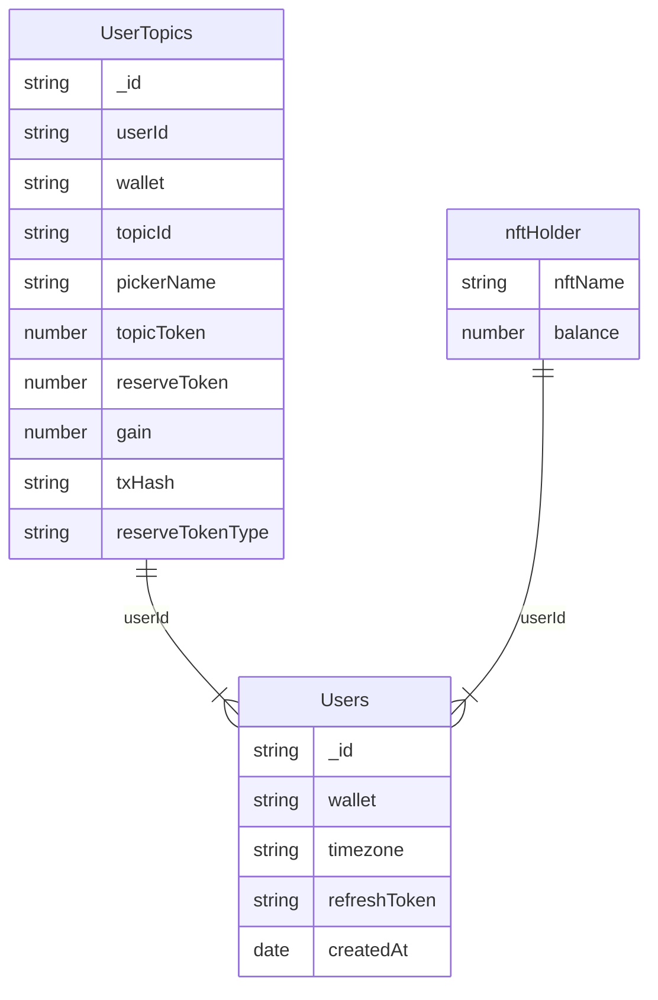

# web-server

### ERD v0.1

```mermaid
erDiagram
  UserTopics ||--|{ Users : userId
  nftHolder ||--|{ Users : userId

  Users {
    string _id
    string wallet
    string timezone
    string refreshToken
    date createdAt

    %% An array of Competitor objects is embedded here
  }

  nftHolder {
    string nftName
    number balance
  }

  UserTopics {
    string _id
    string userId
    string wallet
    string topicId
    string pickerName
    number topicToken
    number reserveToken
    number gain
    string txHash
    string reserveTokenType
  }
```
